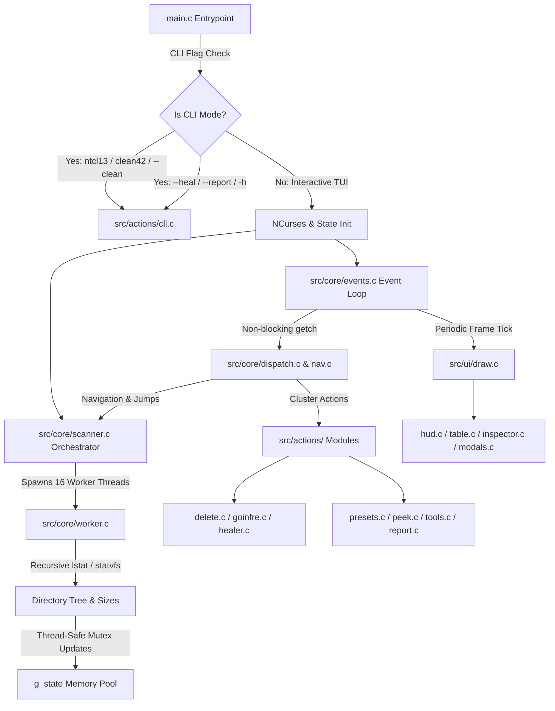

# 🏛️ ft_ncdu System Architecture & Engineering Blueprint

This document explains the high-level software architecture, data flow, concurrency model, and POSIX system calls powering **`ft_ncdu`**.

---

## 🌟 High-Level Architectural Diagram



---

## 🧠 Core Data Structures (`includes/ft_ncdu.h`)

### 1. `t_file_entry`: Single Item Representation
Each entry in a directory is represented by a compact 42-Norminette compliant struct:
```c
typedef struct s_file_entry
{
    char        name[NAME_MAX_LEN];         // Base filename (e.g. "minishell")
    char        path[PATH_MAX_LEN];         // Absolute or relative filepath
    char        symlink_target[PATH_MAX_LEN]; // Destination if symlink
    off_t       size;                       // Apparent byte size (st_size)
    off_t       disk_size;                  // Actual block allocation (st_blocks * 512)
    size_t      items_count;                // Recursive child count (for folders)
    time_t      mtime;                      // Last modification timestamp
    mode_t      mode;                       // POSIX permissions (S_IFDIR, 0755, etc.)
    t_file_type type;                       // TYPE_FILE, TYPE_DIR, TYPE_LINK
    int         marked;                     // 1 if selected with Space, 0 otherwise
    int         is_goinfre_link;            // 1 if target points to /goinfre
    int         is_broken_link;             // 1 if dangling/broken symlink
}   t_file_entry;
```

### 2. `t_app_state`: Central Global Runtime State
To synchronize worker threads, NCurses rendering, and keyboard events:
```c
typedef struct s_app_state
{
    t_file_entry    *entries;               // Raw array of entries (heap pool: 65,536)
    t_file_entry    *filtered;              // Active filtered/sorted view
    int             count;                  // Total entries discovered
    int             filtered_count;         // Entries matching active search/dotfile filters
    int             selected;               // Index of current cursor row
    int             scroll_offset;          // Viewport scroll position
    off_t           total_dir_size;         // Sum of apparent bytes
    off_t           total_disk_usage;       // Sum of actual disk blocks
    off_t           max_item_size;          // Largest single item (for relative gauge bars)
    char            current_dir[PATH_MAX_LEN]; // Current folder path
    char            username[64];           // Current 42 login
    char            search_query[128];      // Active substring search
    t_sort_mode     sort_mode;              // SORT_SIZE_DESC, SORT_NAME_ASC, etc.
    t_size_mode     size_mode;              // SIZE_ACTUAL_DISK vs SIZE_APPARENT
    int             is_searching;           // 1 if search bar is focused
    int             show_hidden;            // 1 if dotfiles visible
    volatile int    is_scanning;            // 1 if background scan threads are running
    volatile int    abort_scan;             // 1 to signal cancellation on directory change
    pthread_mutex_t lock;                   // Global mutex for thread synchronization
    dev_t           root_dev;               // Device ID to prevent cross-filesystem traversal
    size_t          unreadable_count;       // Count of permission-denied folders
    size_t          broken_links_count;     // Total dead symlinks detected
}   t_app_state;
```

---

## ⚡ Concurrency Model: 16-Thread Pool

1. **Step 1: Synchronous First Level Discovery (`read_dir_entries`)**
   - The main scanner reads direct children using POSIX `opendir()` and `readdir()`.
   - Initial metadata (`lstat()`, `readlink()`) is gathered in microseconds.
   - The table renders immediately so the user doesn't see a blank screen.

2. **Step 2: Asynchronous Multi-threaded Worker Pool (`dispatch_workers`)**
   - 16 POSIX threads (`pthread_create`) are spawned.
   - Each thread claims folder entries with strided indices (`idx += SCAN_THREADS`).
   - Recursively measures deep directory block allocations and size metrics.
   - Mutexes (`pthread_mutex_lock(&g_state.lock)`) protect shared aggregate counters.

3. **Step 3: Filesystem Mount Boundary Shielding (`st_dev`)**
   - `lstat` retrieves `st.st_dev`.
   - If `st.st_dev != g_state.root_dev`, the recursive walker skips descending into foreign mounts (e.g. `/proc`, `/sys`, `/goinfre`, network shares).

---

## 🪟 NCurses TUI Architecture

- **Color Pair Matrix (`src/ui/colors.c`)**: Defines high-contrast Catppuccin/Nord-inspired palettes for badges, gauges, borders, and active highlights.
- **Top HUD Deck (`src/ui/hud.c`)**: Queries `statvfs()` to render live Home Quota gauges, Inodes saturation, and Goinfre NVMe free pool status.
- **Explorer Table (`src/ui/table.c`)**: Renders viewport rows with badges (`[DIR]`, `[FILE]`, `[LINK]`, `[DEAD]`), size columns, visual percentage allocation bars, and filenames.
- **Inspector Deck (`src/ui/inspector.c`)**: Renders detailed target metadata (symbolic permissions, exact byte count, child count, symlink destination) and interactive command shortcuts.
