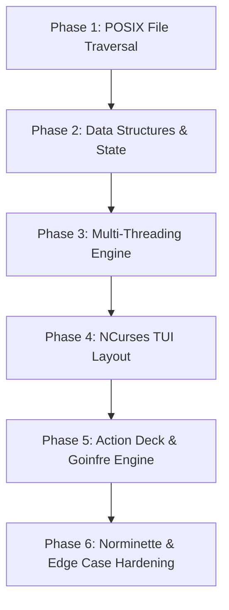

# 🎓 Masterclass: How a 42/1337 Student Can Build a Tool Like This

Building a high-performance terminal utility like **`ft_ncdu`** is one of the best ways to master **C systems programming**, **POSIX APIs**, **multi-threading with Pthreads**, and **advanced NCurses TUI design** while adhering strictly to the **42 Norminette standard**.

Here is the step-by-step roadmap to build your own systems-level CLI/TUI application.

---

## 🗺️ Step-by-Step Development Roadmap



---

### 1️⃣ Phase 1: Master the POSIX Filesystem APIs
Before touching NCurses or threads, build a simple CLI program that traverses a folder and prints sizes.

1. **Read direct children**:
   ```c
   DIR *dir = opendir(path);
   struct dirent *entry = readdir(dir);
   ```
2. **Distinguish files vs directories vs symlinks**:
   - Always use `lstat()` instead of `stat()`. `stat()` follows symlinks, which can cause infinite loops on circular links! `lstat()` reports `S_ISLNK(st.st_mode)`.
3. **Calculate disk blocks**:
   - A file's apparent size is `st.st_size`, but its actual disk allocation is `st.st_blocks * 512`.
   - Sparse files (e.g. Docker images, VM disks) can have apparent size 10 GB but only use 50 MB on disk!
4. **Query file system statistics**:
   - `statvfs(path, &vfs)` gives total blocks (`vfs.f_blocks`), free blocks (`vfs.f_bfree`), and inode counts (`vfs.f_files`).

---

### 2️⃣ Phase 2: Design Clean State & Data Structures
Separate your application state into clean structures:
1. `t_file_entry`: Store item metadata (name, path, apparent size, disk blocks, mtime, permissions, symlink target).
2. `t_app_state`: Centralize global state (pointer to entry pool, selected row, scroll offset, search query, mutex).
3. **Pre-allocate heap pools**: Rather than calling `malloc()` for every file, allocate `malloc(sizeof(t_file_entry) * 65536)` once at startup. This eliminates memory fragmentation and gives 10x faster scanning.

---

### 3️⃣ Phase 3: Add Multi-Threading with Pthreads
Directories like `node_modules` or `.cache` contain 50,000+ files. A single thread will freeze for several seconds.

1. **Strided Worker Pool**:
   - Spawn 16 threads with `pthread_create()`.
   - Thread $i$ processes items: $i, i + 16, i + 32, \dots$
2. **Thread Safety**:
   - Protect global counters (`total_dir_size`, `max_item_size`) with a mutex:
     ```c
     pthread_mutex_lock(&g_state.lock);
     g_state.total_disk_usage += item_blocks;
     pthread_mutex_unlock(&g_state.lock);
     ```
3. **Cancellation Flag**:
   - Use a `volatile int abort_scan` flag so if the user navigates to another folder mid-scan, worker threads immediately abort without freezing.

---

### 4️⃣ Phase 4: Build the NCurses TUI
1. **Initialize NCurses cleanly**:
   ```c
   initscr();
   cbreak();
   noecho();
   keypad(stdscr, TRUE);
   curs_set(0);
   start_color();
   use_default_colors();
   ```
2. **Terminal Dimensions**:
   - Use `getmaxyx(stdscr, max_y, max_x)` on every frame to adapt dynamically.
   - Split the screen proportionally (e.g. 58% for table, 42% for inspector).
3. **Smooth Scrolling**:
   - If `selected >= scroll_offset + list_height`, increment `scroll_offset`.
   - If `selected < scroll_offset`, decrement `scroll_offset`.

---

### 5️⃣ Phase 5: Implement 42/1337 Specific Actions
1. **Goinfre Relocation**:
   - Auto-detect `/goinfre/$USER`, `/sgoinfre/$USER`, or `/tmp/goinfre_$USER`.
   - Move directory with `system("mv ...")` and create symlink `symlink(target, linkpath)`.
2. **Station Healer**:
   - When switching computers, scan `$HOME` for symlinks pointing to `/goinfre/*`.
   - Run `mkdir -p` on the destination path on the new local machine so applications don't crash.
3. **Safe Shell Escaping**:
   - Never pass raw user filenames directly to `system()`. If a folder is named `foo; rm -rf ~`, raw concatenation will destroy your home directory!
   - Write a `shell_escape()` function that wraps arguments in single quotes and escapes embedded quotes as `'\''`.

---

### 6️⃣ Phase 6: Norminette Compliance & Hardening
1. **Keep functions small ($\le 25$ lines)**: Decompose large functions into focused helpers.
2. **Bundle arguments**: Wrap coordinates `(y, x, h, w)` into a `t_rect` struct so functions never exceed 4 arguments.
3. **Zero Ternaries**: Replace all `? :` with clean `if/else` statements.
4. **Compile with Strict Flags**:
   ```bash
   gcc -Wall -Wextra -Werror -O3 -march=native -lncurses -pthread
   ```
